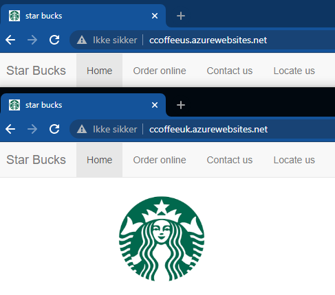
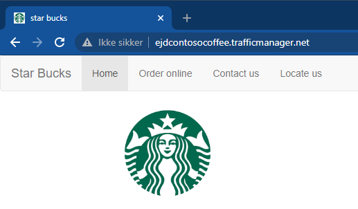
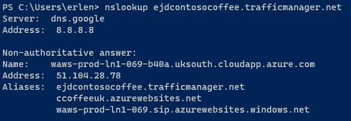
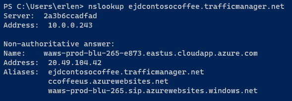

# Demonstration of the WebApps

This is a simple demonstration of how I tested the webapps and the Traffic Manager profile.

## DEMO

By going to the webapps urls i check for the expected site.

Then i check if the traffic manager redirects me to the website as well.

Now i know the webapps are up and running, but i do not know if the traffic manager actually redirects correctly. To do this i will be using the nslookup command and see which webapp i get redirected to.

I see that i am connecting to the UK webapp, and that is expected. To check traffic manager for a US scenario i connect to a VPN to America and run the command again.

With this i know that the traffic manager is redirecting acording to the case requirements.
