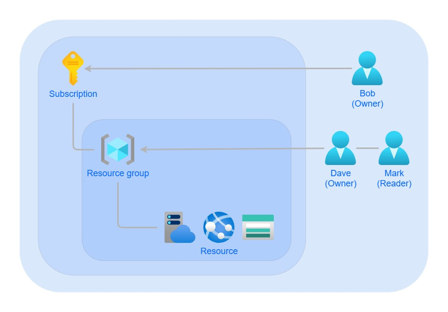
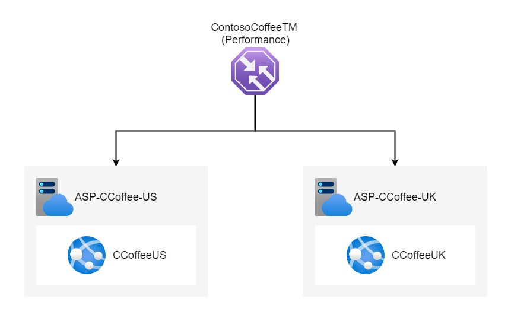
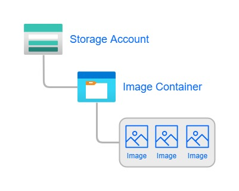

# Contoso Coffee Shop Case Study

This is my solution to a Case Study in the AZ-104 course. Below is a visual representation of the solution. Under "Templates" you can find a Bicep template to deploy the webapp resources, with some guidance to deploy it. I also included guidance to assigning roles under "User-accounts".

## User accounts

Contoso Coffee required 3 Administrators, Bob, Dave and Mark. Based on the Case description I granted them the access they needed. The diagram below shows the roles and scope I assigned to the users.

* Bob is the owner of Contoso Coofee and therefore should be assigned the role global administrator in Azure AD.

* Dave is going to administer the website. Therefore he should be assigned the contributer role scoped to the resource group that contains the website. In this way he has full admin access to the resources related to the website, exept managing other users access to the resources.

* Mark require read access to the resources. Therefore he should be assigned the reader role scoped to the resource group.

## Website hosting

Contoso Coffee wants to host a globally accessible website. They want their users to be able to access a local server. Therefore I deployed two websites, one in East US for the US users and one in UK South for their UK users. To route the users to their local server I placed a Traffic Manager in front of the websites utulizing the Performance routing method. With the Traffic Manager users accessing the website are automatically routed to the closest web app based on the Traffic Managers latency table. 

For more info on Performance routing method go to: https://docs.microsoft.com/en-us/azure/traffic-manager/traffic-manager-routing-methods#performance-traffic-routing-method

## Contoso Coffee data storage

Contoso Coffee is planning to store large amount of images, planned to be displayed on screens in the coffee shop. Data should also be automatically archived.

To solve this issue i decided to create a storage account and a blob container within the storage account for storing the images. This is represented in the diagram bellow. For access to the container one simply generates Shared access tokens. In this way one can give the developers of the image display app the SAS URL so they can integrate the images into the app. To meet the requirements of archiving data I configured a Lifecycle management rule that archives base blobs that havent been modified in 30 days.

