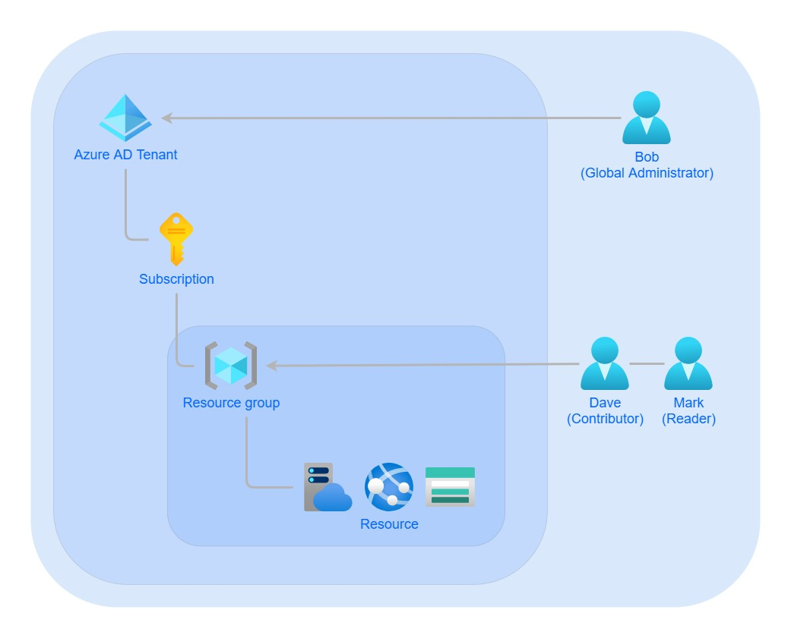
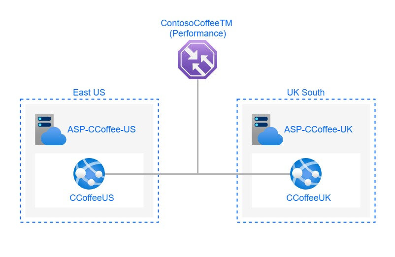

# Contoso Coffee Shop Case Study

This is my solution to a Case Study in the AZ-104 course. Below is a visual representation of the solution. In the Templates folder you can find a Bicep template to deploy the resources, with some guidance to deploy it.

## User accounts

Contoso Coffee required 3 Administrators, Bob, Dave and Mark. Based on the Case description I granted them the access they needed. The diagram below shows the roles and scope I assigned to the users with Azure RBAC.

* Bob is the owner of Contoso Coofee and therefore should be assigned the role global administrator in Azure AD.

* Dave is going to administer the website. Therefore he should be assigned the contributer role scoped to the resource group that contains the website. In this way he has full admin access to the resources related to the website, exept managing other users access to the resources.

* Mark require read access to the resources. Therefore he should be assigned the reader role scoped to the resource group.

## Website hosting

Contoso Coffee wants to host a globally accessible website. They want their users to be able to access a local server. Therefore I deployed two websites, one in East US for the US users and one in UK South for their UK users. To route the users to their local server I placed a Traffic Manager in front of the websites utulizing the Performance routing method.

## Contoso Coffee data storage

**From case description:**
Contoso coffee is planning to store a large amount of image information that will be shared with staff members and clients. These images will be scans of 35 and 120 film for hipster photography that will be displayed around the coffee shop. The storage solution should minimise costs by automatically archiving data onto slower storage when required. A SAS key solution should be created for a future image gallery solution to display images on a TV in the Coffee Shop running a small Raspberry Pi solution locally hosting a web page to display the images. Bonus points for creating an image display web app.

